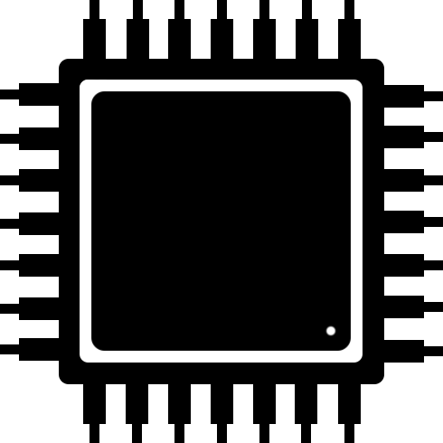

# CPU Info

CPU Info provides information about device hardware and software. 

# Supported platforms 

| Android | Android TV | Wear OS | iOS | Desktop |                                                                                   Wasm                                                                                   |
|:-------:|:----------:|:-------:|:---:|:-------:|:------------------------------------------------------------------------------------------------------------------------------------------------------------------------:|
|    ✅    |     ✅      |    ✅    |  ✅  |    ✅    | ✅ [In preview](https://kgurgul.com/assets/cpuinfo/) Known issues: [1](https://youtrack.jetbrains.com/issue/CMP-6900/NavigationRail-items-not-visible-on-WASM-JS) |

# Tech stack

* [Kotlin Multiplatform](https://kotlinlang.org/docs/multiplatform.html)
* [Compose Multiplatform](https://www.jetbrains.com/lp/compose-multiplatform/)
* [Jetpack ViewModel/Lifecycle](https://www.jetbrains.com/help/kotlin-multiplatform-dev/compose-lifecycle.html)
* [Coroutines](https://github.com/Kotlin/kotlinx.coroutines)
* [Koin](https://github.com/InsertKoinIO/koin)
* [Coil](https://github.com/coil-kt/coil)
* [DataStore](https://developer.android.com/kotlin/multiplatform/datastore)
* [pytorch/cpuinfo](https://github.com/pytorch/cpuinfo)
* [OSHI](https://github.com/oshi/oshi)

# TODO

* Add about section
* Upload Wear OS app to Play Store when SDK 35 will be supported

# License

    Copyright 2017 KG Soft

    Licensed under the Apache License, Version 2.0 (the "License");
    you may not use this file except in compliance with the License.
    You may obtain a copy of the License at

       http://www.apache.org/licenses/LICENSE-2.0

    Unless required by applicable law or agreed to in writing, software
    distributed under the License is distributed on an "AS IS" BASIS,
    WITHOUT WARRANTIES OR CONDITIONS OF ANY KIND, either express or implied.
    See the License for the specific language governing permissions and
    limitations under the License.
